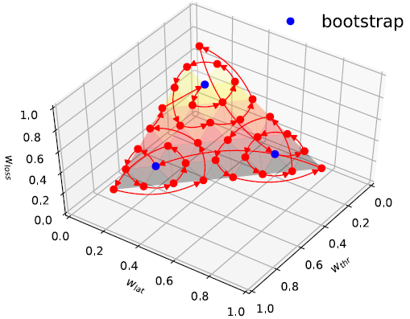
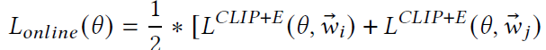

# Multi-Objective Congestion Control

## Abstract

        能否设计一个Congestion Control Algorithm来满足不同的目标？提出了MOCC，MOCC的核心是一个新的CC多目标强化学习框架，它可以自动学习不同应用需求和相应的最优控制策略之间的相关性。

## 1、Instruction

        提出了MOCC，这是第一个尝试解决这个问题的多目标CC算法（§3）。MOCC的核心是一个新的多目标强化学习框架，用于CC自动学习不同应用需求及其相应最优控制策略之间的相关性。MOCC明确将绩效目标纳入状态输入和动态奖励函数，并利用带有偏好子网络的新策略神经网络将不同目标与最优控制策略相关联（§4.1）。这使得MOCC能够有效地建立单个相关性模型，以支持不同的性能目标。在此框架下，MOCC进一步应用转移学习，将从过去经验中学习到的知识快速转移到新的应用程序中，并针对给定的目标优化CC算法，即使是不可预见的。

        我们利用OpenAI Gym和Aurora来实现训练和适应组件，并使用并行训练来减少训练时间。

## 2、Background and Motivation

        互联网应用程序对网络有不同的性能要求，通常以吞吐量、延迟、抖动和丢包率等指标为特征。应用需求对互联网CC算法提出了不同的要求。理想情况下，CC算法应该是多目标的，以同时支持不同的应用需求。然而，现有的CC解决方案都无法做到这一点。

        现有的基于学习的CC可以针对给定的目标进行优化。下表列出了最先进的基于学习的CC算法所使用的几个奖励/效用函数。奖励函数通常表示为吞吐量、延迟和损失率等指标的组合。系数参数(𝛼, 𝛽,𝛾, 𝛿, 𝜀, 𝑏, 𝑐) 可以基于应用程序需求明确地表示这些度量的相对重要性。因此，基于学习的CC能够很好地实现特定目标。

        但是，这些基于学习的CC不能支持多个目标。如表1所示，当前基于学习的算法设置了吞吐量、延迟和丢失率的相对重要性，以实现不同的性能目标。这些系数参数在训练期间是固定的。因此，经过训练的代理一次只能针对特定目标进行优化。

### 设计目标：

        •多目标：该算法可以支持具有不同性能目标的不同应用程序，并为各个应用程序提供最佳控制策略。

        •快速自适应：该算法可以快速适应具有未知需求的新应用程序，而不会影响旧应用程序的性能。

        •一致的高性能：算法应在各种网络条件下保持高性能，无需任何预先假设。

## 3、Multi-Objective Learning for CC

        在每个时间间隔中，Agent（即发送方）观察一组网络度量，如吞吐量、延迟和分组级事件等，并将这些值输入神经网络，神经网络输出动作，即下一个间隔的发送速率。同时，测量得到的网络性能（例如吞吐量和延迟），并将其作为奖励传回Agent，用于训练和改进神经网络模型。

        上面的方法有一个的缺点：该算法一次只能针对单个目标进行优化。问题的关键是是模型（下图a）无法识别和区分多个不同的应用程序。因此，支持多个应用程序需要多个不同的模型，而且，适应一个新的应用程序需要从头开始重新训练模型，这需要时间，使其既不是multi-objective的，也不是quick-adaptive的。

        从模型结构的角度来看（下图b），我们做了两个重要的改变：（1）我们通过引入一个偏好子网络来扩展策略神经网络，该偏好子网络明确地将应用程序需求作为状态输入，每个需求由性能度量的权重向量表示，使我们的模型除了网络条件之外还了解不同的目标；（2）我们用当前正在训练的应用程序的权重向量动态参数化奖励函数，这使我们的模型能够学习相应目标的最优策略。因此，MOCC自动学习应用程序要求和相应的最优速率控制策略之间的相关性，从而实现multi-objective。

    训练MOCC模型可以分为离线预训练和在线适应两个部分。在离线阶段，我们使用一组分布良好的地标权重向量对模型进行预训练，以学习应用程序需求和最优策略之间的相关性。这给在线阶段带来了两个重要的好处。首先，对于一个新的应用程序，即使是不可预见的，MOCC也可以立即提供一个合理的策略，在过渡期间保持性能。第二，从这种基础相关性模型转移，MOCC能够通过几个RL迭代快速收敛到新应用程序的最优策略，比从头学习快得多。为了避免忘记旧应用程序的已学习策略，我们通过优化新到达的应用程序和采样的历史应用程序来修改在线学习的损失函数，以便我们的MOCC可以召回以前应用程序的学习策略。

## 4、Design

### 4.1 Model Architecture

        为了实现multi-objective，MOCC主要做出了两项变动：1）在policy网络中加入performance sub-network；2）在状态输入和动态奖励函数中包含应用程序需求。

#### States：

        MOCC的状态输入应该包括应用程序的需求和网络条件。

        为了表达应用程序需求，我们使用权重向量$\vec{w}$ =<$𝑤_{tℎ𝑟} ,𝑤_{𝑙𝑎𝑡} ,𝑤_{𝑙𝑜𝑠𝑠}$>，其中$w_i\in(0,1)$，且$\sum_iw_i=1$。例如，＜0.8、0.1、0.1＞表示应用程序需要高吞吐量，＜0.4、0.5、0.1＞则表示应用程序对延迟敏感，但仍需要一定的吞吐量。

        对于网络状态，与Aurora中的相同，使用统计向量$\vec{g_t}$ =<$𝑙_𝑡,𝑝_𝑡,𝑞_𝑡$> 表示在时间t的网络状态。$l_t$ 是发送比率，定义为发送方发送的数据包超过接收方确认的数据包；$p_t$是latency ratio，表示在当前时间t内的平均延迟与观测到的最小延迟之间的比值；$q_t$ 是latency gradient，是延迟相对于时间的导数。此外，为了捕捉网络动态的趋势和变化，我们使用了固定长度的网络统计历史，而不是最近的历史（即$\vec{g}(t,\eta)=<\vec{g}_{t-\eta},\vec{g}_{t-\eta+1},...,\vec{g}_t>$, 长度𝜂 > 0）作为网络状态输入。

#### Actions：

        观察state $s_t=(\vec{w},\vec g_{(t,\eta)})$，RL Agent选择一个动作$a_t$。然后MOCC发送方根据下面的公式以及得到的$a_t$，将发送速率从$x_t$更新为$x_{t+1}$。

        其中，𝛼 是用于抑制振荡的比例因子。我们选择连续发送速率调整来代替离散发送速率调整，以提高模型的鲁棒性并实现更快的收敛。

#### Rewards：

        MOCC reward function $r_t$ 使用权重向量$\vec{w}$ 以便RL Agent能够捕获应用程序的需求。

        其中，$O_{thr}=\frac{Measured\ Throughput}{Link\ Capacity},O_{lat}=\frac{Base\ Link\ Latency}{Measured\ Latency},O_{loss}=1-\frac{Lost\ Packets}{Total\ Packets}$

是度量带宽，延迟和丢包率的参数。

#### Model structure：

        MOCC采用actor-critic方法，RL训练网络中的基本方法，该方法使用两个神经网络：Actor网络和Critic网络（如下图所示）。

        为了支持multiple objectives，MOCC使用性能偏好子网（preference sub-network，PN）扩展actor网络和critic网络。

### 4.2 Offline Training

#### Two-phase training：

        为了训练multiple objectives RL，一种简单的方法是将其分解为多个单目标RL[36]。如果我们可以枚举所有可能的目标并迭代训练每个目标，则多目标RL可以实现最优凸收敛集。然而，在我们的MOCC中，存在无限可能的目标，效率很低。

        为了提高训练效率，不是探索整个目标空间，而是训练一个子集的标志性目标，比如𝜔, 这可以产生一个令人满意的模型𝜔（实现中取36） 有几十个目标需要几天的训练。为了加快速度，我们引入了两个阶段的训练：引导和快速遍历。在引导阶段，我们通过选择少量目标进行训练来构建基础模型。

        然后，在快速遍历阶段，在基础模型的基础上，我们加速对剩余模型的训练$\omega-$通过采用基于邻域的迁移学习策略实现3个目标。该方法基于这样的观察，即当两个RL具有接近的目标（即相似的权重向量）时，它们的最优解是接近的。因此，当训练RL时，我们可以通过利用其相邻RL的解决方案来加速。为此，$\omega$ 的安排如下图所示，我们以基于邻域的方式从一个目标迭代训练到其邻居，并以循环方式遍历所有目标。请注意，每次我们都不会训练一个目标，直到趋同，而是只训练几个步骤，以便在所有目标上实现平衡的改进。

#### Policy optimization algorithm：

        在用于训练RL的各种不同算法中，我们采用邻近策略优化（Proximal Policy Optimization，PPO）作为训练MOCC的策略优化算法。这是一种策略梯度方法，用估计的梯度更新模型，以最大化期望的总回报。我们选择PPO是因为：1）它是最先进的方法，易于调整；2）它在连续控制问题上表现得特别好，这使得它适合于确定发送速率。

### 4.3 Online Adaptation

        离线预训练模型有效地将应用程序需求与最佳策略相关联。对于一个新的应用程序，即使需求是不可预见的，MOCC也可以生成适度的速率控制策略，在一开始就为新应用程序提供合理的性能。其次，从这种中等模型开始，通过转移学习，MOCC能够快速收敛到新应用程序的最优模型，只需几次RL迭代，这比从头学习快得多。这两个好处使MOCC能够适应任何新的应用程序。

        然而，有一个问题：我们不希望在适应新应用程序的同时，牺牲旧应用程序的性能。与所有目标都是人工生成并均匀分布的离线培训不同，真实环境中的目标分布可能存在偏差：有些应用非常频繁，有些则很少。在这种偏差下，传统的RL算法将过度适应那些新的频繁应用，但逐渐忘记那些旧的罕见应用，这是不可取的。

        为了避免这个问题，MOCC使用了需求重演学习算法。在线学习期间，MOCC商店在很长一段时间内遇到了应用程序（权重向量）。对于每个在线训练步骤，都会根据当前目标和从存储的应用程序池中随机抽取的旧目标对模型进行训练。在线学习目标定义为：

        其中$w_i$表示当前应用程序的需求，$w_j$表示抽样的旧的应用程序要求，$L^{CLIP+E}$是PPO surrogate objective function。通过这种方式，MOCC不仅学习新的应用程序，还召回旧的应用程序并强化以前学习的策略。因此，MOCC可以保留旧应用程序的学习策略，同时适应新应用程序。

## 5 Implementation

#### Offline training：

        MOCC策略网络使用完全连接的MLP（多层感知器），分别具有64和32个单位的两个隐藏层，以及tanh激活函数来输出高斯分布的平均值和标准差。批评者网络使用相同的神经网络结构来估计标量值函数。我们控制熵因子𝛽 在1000次迭代中从1衰减到0.1，并设置限幅阈值𝜖 = 0.2.对于学习速率，我们采用了著名的自适应学习速率优化算法Adam，switch始终优于标准SGD方法。下表中列出了重要的训练参数设置。我们使用TensorFlow 1.14.0实现了我们的模型架构。

        为了进一步加快MOCC探索大规模目标的最佳解决方案，除了§4.2中介绍的两阶段培训外，我们还采用了并行培训。我们使用Ray和RLlib实现了该架构，以构建多个并行环境。为了兼容性，我们利用Ray API在训练和测试期间声明神经网络。

#### Online Deployment：

        MOCC模型在模拟器中离线训练后，需要与真实的互联网应用程序一起在线部署。为了更好的可移植性，我们将所有MOCC函数封装到一个库中。我们的库提供三个主要功能：

1）注册(𝑤)。在使用MOCC之前，我们应该通过提供需求/偏好（权重向量𝑤) 应用程序的。

2）报告状态(𝑠𝑡)。 在每个时间间隔，我们都应该报告最新的网络状态(𝑠𝑡 ) 至MOCC。

3）获取发送速率（）。在发送数据包时，我们使用此函数来获得MOCC计算的发送速率。

        在我们的实现中，我们将MOCC与UDT和CCP集成，以构建用户空间MOCC和内核空间MOCC。UDT是一种广泛使用的用户空间实现。UDT中的填充助手将与MOCC库交互并获取发送速率。CCP是一种更通用的解决方案，可以在数据路径（如Linux内核网络堆栈）之外实现拥塞控制。我们将MOCC与CCP集成，以实现更多通用应用。与UDT相比，使用CCP的MOCC实现了更低的CPU开销。

        Training/Testing 参数设置如下表所示：

