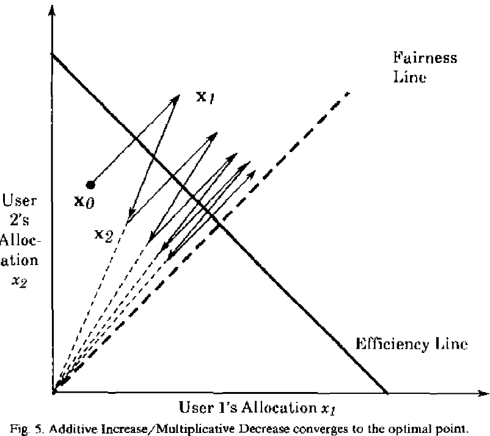
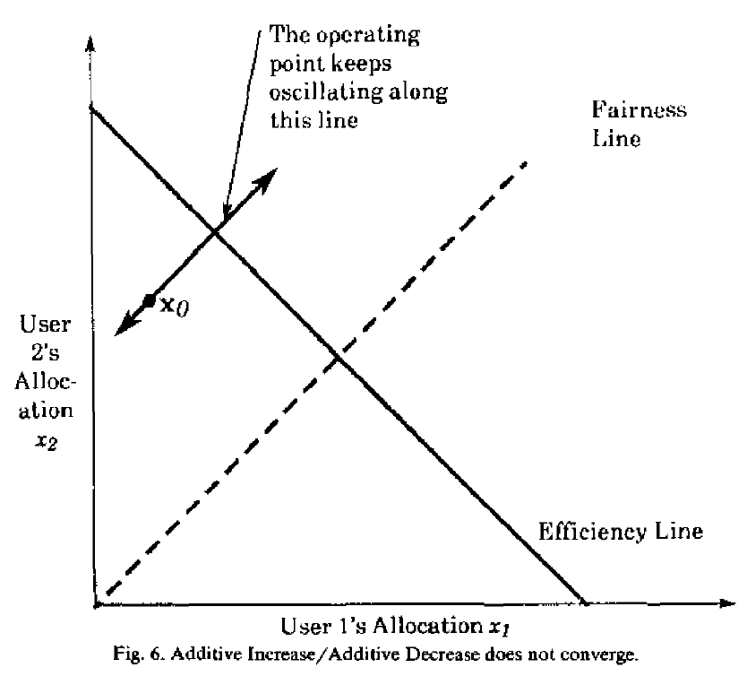
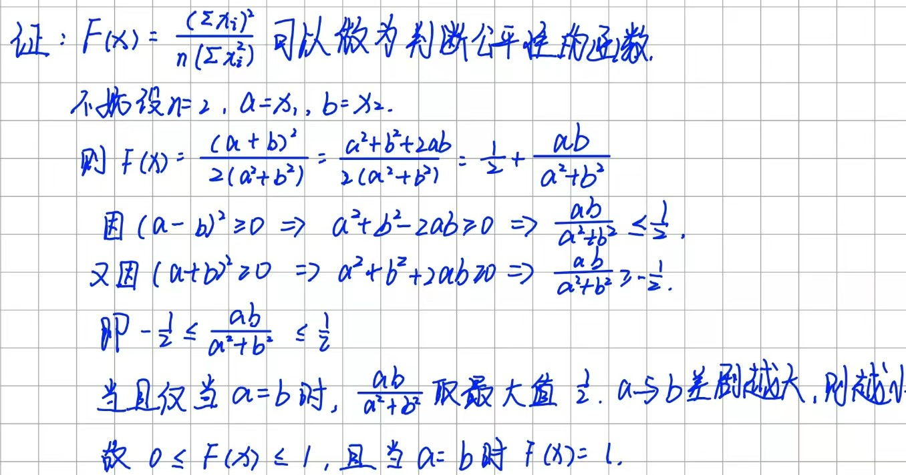
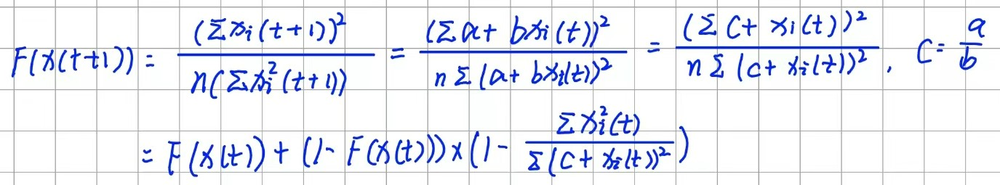
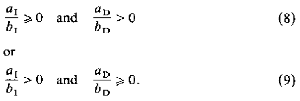
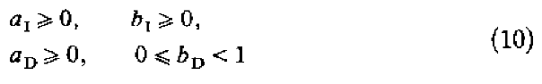
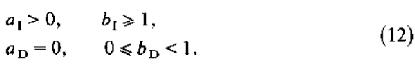

# 一、四种控制算法

## 1.1 Multiplicative Increase Multiplicative Decrease

        其中，$b_1$>1，0＜$b_D$＜1。所有用户都通过将以前的cwnd乘以一个常数来增加或者减少cwnd。

## 1.2 Additive Increase Additive Decrease

        其中，$a_1$＞0，$a_D$＜0。所有用户都通过将以前的cwnd加上一个常数来增加或者减少cwnd。

## 1.3 Additive Increase Multiplicative Decrease

## 1.4 Multiplicative Increase Additive Decrease

# 二、AIMD以及AIAD的分析

        在Efficiency Line上方的点表示该用户Overload，在下方的点表示该用户Underload。越接近Fairness Line表示该算法的公平性越好。Fairness Line与Efficiency Line的交点为控制的最优点，既能保证效率（带宽利用率最高），也能保证不同流之间的公平性。其中与Fairness Line平行的线表示的是线性增加/减少，经过远点的线表示乘性增加/减少。

## 2.1 AIMD

        上图说明了AIMD控制策略从点$x_0$开始的控制轨迹。点$x_0$低于Efficiency Line，因此线性增加cwnd，达到$x_1$后，在Efficiency Line之上，所以乘性减少cwnd，达到$x_2$，又在Efficiency之下，重复上述步骤，直至收敛到在最佳状态附近震荡。注意，$x_2$的公平性比$x_0$更好（距离Fairness Line更近），每个循环之后公平性都会逐渐变好，最终收敛到最佳状态，围绕最佳状态附近震荡。

## 2.2 AIAD

        上图显示了从位置$x_0$开始使用AIAD算法的轨迹。只能沿着过x0的直线来回震荡，无法收敛到Fairness Line，只能收敛到Efficiency Line。

## 2.3 Convergence to Efficiency

        为了保证能够收敛到Efficiency，需要确保系统能够对相应的反馈做出正确的反应，即负反馈。发现cwnd过大之后，确保系统不会继续增加cwnd，反之，发现cwnd过小，确保系统不会继续降低cwnd。公式如下：

$$
y(t)=0  \Longrightarrow \sum  x_i(t+1)>\sum x_i(t)
$$

$$
y(t)=1 \Longrightarrow \sum x_i(t+1)<\sum x_i(t)
$$

## 2.4 Convergence to Fairness

### Fairness Definition：

$F(x)=\frac{(\sum x_i)^2}{n(\sum x_i^2)}$

        下面有个来自我自己的简单证明（不怎么严谨，理解意思即可），为啥要用这个函数来作为判断公平性的方法。

        公平性在0-1之间，完全公平的分配，$F(x)=1$，完全不公平的分配，$F(x)=\frac{1}{n}$，当$n\rightarrow ∞$时，$F(x)\rightarrow 0$。

### Convergence

$F(x(t))\rightarrow 1$ as $t\rightarrow ∞$

        为了保证$F(x(t+1))\geq F(x(t))$，需要保证$c\geq0$，且当$c=0$时，$F(x(t+1))= F(x(t))$。为了保证能够公平性能够收敛，需要保证：

        在（8）中，公平性在速率降低过程中提高；在（9）中，公平性在速率提升过程中提高，保证最终趋于公平。上式意味着$a_I$和$b_I$以及$a_D$和$b_D$符号应该相同。最终可得：

        其中，$a_I$和$b_I$不能同时为0，$a_I$和$a_D$不能同时为0。

## 2.5 Distributedness

        为了保证能够同时收敛到Efficiency和Fairness需要满足：

        （后面省略了一些证明，具体的可以参考论文 Analysis of increase and decrease algorithms for congestion avoidance in computer networks）

# 三、结论

## Proposition 1

        论文中的原文如下：

In order to satisfy the requirements of distributed convergence to efficiency and fairness without truncation, the linear decrease policy should be multiplicative, and the linear increase policy should always have an additive component, and optionally it may have a multiplicative component with the coeffic:ient no less than one.

        简单来说，就是为了保证能够收敛到Efficiency和Fairness，增加策略应该保证有加法分量（可以有系数不小于1的乘法分量），减少策略应该是乘法的。
