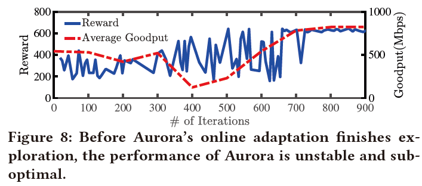
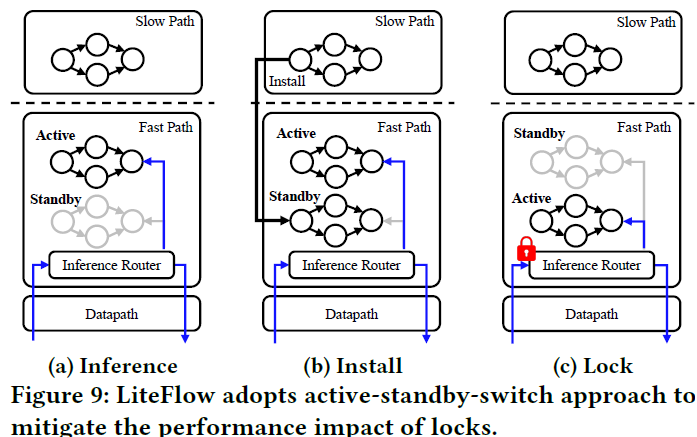

# LiteFlow: Towards High-performance Adaptive Neural Networks for Kernel Datapath

# Abstract

        自适应神经网络已被用于优化OS内核数据路径功能，因为它们可以在不断变化的环境下获得优异的性能。然而，如何部署这些NNs仍然是一个挑战。一种方法是在用户空间中部署这些自适应NN。然而，这样的用户空间部署要么受到高跨空间通信开销的影响，要么受到低响应性的影响，从而严重影响了功能性能。另一方面，由于模型调整算法的计算逻辑通常很复杂，会干扰正常数据路径执行的性能，因此纯内核空间部署也会导致很大的性能下降。

        本文介绍了LiteFlow，一种为内核数据路径构建高性能自适应神经网络的混合解决方案。在其核心，LiteFlow将自适应神经网络的控制路径解耦为：（1）用于高效模型推理的内核空间快速路径，以及（2）用于有效模型调整的用户空间慢速路径。我们已经用Linux内核数据路径实现了LiteFlow，并使用三个流行的数据路径功能对其进行了评估，包括拥塞控制、流调度和负载平衡。与之前的工作相比，LiteFlow在拥塞控制方面的吞吐量提高了44.4%，在流调度和负载平衡方面，长流的完成时间分别提高了33.7%和56.7%。

# 1 Introduction

        OS内核数据路径是在OS内核中实现的上层应用程序和下层网络硬件之间的数据路径，提供了多种重要的网络功能，包括拥塞控制（CC）、分组过滤、调度和排队等功能，我们已经看到了采用自适应神经网络（NN）来优化它们的日益增长的趋势，因为自适应神经网络可以不断学习和适应变化的网络环境。自适应神经网络可以同时执行模型推断，以基于输入数据给出预测结果。到目前为止，自适应神经网络已用于CC、分组转发和路由、调度等，以优化功能性能，例如，为CC实现更好的吞吐量，或为调度实现更好的流完成时间（FCT）等。以CC为例，Aurora，一个3层神经网络，可以实现比BBR高38.5%的延迟，同时快速适应不同的网络环境。

        自适应神经网络的当前部署机制在很大程度上损害了上述优势。一种方法是在用户空间中部署NN。例如，Aurora使用TensorFlow和GYM来部署具有纯用户空间传输实现的NN：UDT；MOCC扩展了Aurora的设计，并进一步使用CCP将用户空间部署的NN与内核空间网络堆栈集成。使用这些现有的工具能够很容易的在用户空间部署，但需要NN与内核空间网络数据路径功能频繁通信。在本文中，我们发现，无论我们如何选择通信间隔，跨空间通信都会损害数据路径功能的性能，从而损害自适应神经网络带来的益处。例如，我们的实验表明，在大间隔（例如100ms）下，由于神经网络的响应性降低，单个流的输出比小间隔（例如1ms）低14.9%。相比之下，在较小的时间间隔内，由于不可忽略的开销（§2.2），当处理许多并发流时，数据路径的吞吐量下降了40.4%。Orca也观察到了这个问题，但它采用了两级控制设计，减轻了但并没有完全解决性能问题。

        另一种方法是直接在内核空间中实现自适应神经网络。现有的方案探索了两个方向，但都存在性能问题。

    1）一个方向是在内核空间中实现完整的自适应神经网络，包括模型调整和推理。然而，这种实现不可避免地会导致数据路径函数性能下降：（1）自适应神经网络所需的模型调整算法消耗大量计算资源，干扰数据路径函数的处理逻辑。（2） 使用高级CPU指令（如SIMD/FP指令）能实现高精度，但它引入了开销，进一步降低了数据路径函数的性能（在我们的实验中，我们观察到内核空间中的自适应神经网络即使使用小批量，也会使网络吞吐量降低高达90%）。

    2）另一个方向是放弃模型调整并将NN转换为仅用于推断的轻量级NN，例如，通过整数量化优化NN或将其转换为决策树。这些轻量级的神经网络缺乏重要的学习和适应环境动态的能力。我们的实验结果表明，这种适应能力的缺乏导致了30%以上的性能下降。

        我们可以为内核数据路径设计高性能自适应神经网络来优化函数性能吗？为了回答这个问题，我们意识到关键在于现有的自适应神经网络作为一个整体执行模型推理和模型调整。然而，模型推理需要快速执行，这更适合于内核空间；而模型调整需要高精度和密集的计算，这更适合用户空间。

        我们提出LiteFlow，能将自适应神经网络的控制路径解耦为在内核空间快速路径中的模型推断和在用户空间慢速路径中的模型调整，从而可以分别在正确的位置执行模型推断和模型调整。

**挑战：**

    1）该方法需要两个不同设计目标的NN：一个与内核空间开发环境兼容（使用C实现），并且可以在内核空间中高效执行，另一个与用户空间机器学习框架兼容，例如TensorFlow，例如使用在Python中实现的FP32）

    2）由于只有用户空间部署的NN得到进一步调整，内核空间部署的神经网络无法及时对不断变化的网络环境做出反应，从而影响性能

    3）调整用户空间部署的NN需要来自内核空间的数据，这会导致频繁的跨空间通信导致性能下降

**解决**：

    1）通过高精度整数量化（即，执行可以保持高精度的整数量化）自动优化NN，并利用代码转换技术（即，将用一种编程语言编写的代码转换为另一种语言）生成内核空间兼容快照（它被命名为快照，因为它不会被进一步调整）

    2） 使用用户空间调整的NN保守地更新快照（通过考虑必要性和正确性，详见§3.3），以确保快照在不断变化的环境下准确；

    3）基于网络特性在亚秒尺度上不会改变的观察结果，对批处理数据执行在线自适应[55]，以同时实现高精度和低开销。

        在用户空间中，LiteFlow为用户提供标准接口，以提供他们自己的在线适应功能的定制实现。因此，它可以与任何学习框架和实用程序集成，如TensorFlow、PyTorch、MXNet、GYM等。在内核空间中，LiteFlow使用Linux内核v4.15.0实现，并遵循模块化原则，将整个功能分为不同的内核模块。因此，它是通用的，可以为不同的数据路径函数支持不同的NN。

# 2 Background ＆ Motivation

## 2.1 Adaptive Neural Networks for Kernel Datapath Function

        与将训练与推理分离的传统神经网络部署不同，自适应神经网络将它们作为一个整体进行组合，可以不断学习并适应变化的网络环境，同时提供卓越的性能。因此，采用它们来优化数据路径功能性能的趋势越来越大。自适应神经网络在网络数据路径中的应用包括拥塞控制、流调度、网络路由/转发等。

        与传统的优化解决方案（严重依赖运营商的专业知识来实现理想的性能）不同，NN使用数据驱动的方法来自动和连续地学习优化策略，而无需任何人工参与，这可以快速适应环境的动态变化。此外，由于神经网络具有巨大的非线性拟合能力，它们的性能优于手工制作的解决方案。

        在用户空间中部署NN，例如，使用TensorFlow[10]、PyTorch[50]、GYM[19]等。当内核数据路径函数需要进行一些更新时，例如，响应网络拥塞改变流发送速率，它将向用户空间部署的NN发送所需的输入数据，以计算相应的推断结果。然后，这些结果将被发送回内核空间以供执行。

        为了快速响应网络变化，用户空间部署的NN需要与相应的内核空间数据路径功能进行频繁通信。然而，两个空间之间的频繁通信将消耗大量CPU资源，从而减少可分配给内核数据路径函数以执行其数据包/流量处理逻辑的CPU资源量。因此，现有的自适应神经网络在支持大量并发网络处理管道时无法提供高性能。

## 2.2 Performance Penalty

        我们选择作为对比的算法是Aurora。我们使用TensorFlow和GYM部署Aurora，以实现在线适应。为了与内核空间CC功能交互，我们进一步使用CCP调用用户空间部署的Aurora模型（CCP Aurora）。CCP Aurora需要跨空间通信来执行拥塞控制。我们使用TCP BBR作为基线，这是一种完全在内核空间中实现的传统CC算法。

        **只有细粒度的跨空间通信才能获得良好性能**。当设置较小的通信间隔（例如1ms）时，队列长度很小且稳定。但当我们增加间隔时，队列长度会增加并显著振荡。结果表明，细粒度的通信间隔对于使CCP Aurora实现良好的网络性能是必要的。

        **细粒度跨空间通信的开销很高**。首先，当流的数量增加时，CCP Aurora的归一化总吞吐量降低。第二，通信间隔越短，性能越差。当有10个并发流时，1ms间隔的标准化聚合吞吐量为5.5Gbps，低于基线16.1Gbps的一半。

        原因是跨空间通信具有很大的CPU开销。当内核需要调用用户空间程序（即请求CCP Aurora获取推断结果）时，它会生成一个软件中断，将执行流从内核空间切换到用户空间，从而导致处理中断的额外开销。当存在多个并发流时，剩余的CPU资源不足以完全支持数据路径函数的内核处理管道。软件中断主要是由跨空间切换引起的，而不是Aurora的用户空间执行。细粒度通信间隔将消耗大量CPU资源，从而为数据路径功能执行正常的数据包处理逻辑留下有限的CPU资源。

        **结论**。在追求高性能数据路径功能时，部署在用户空间的NN都会遇到问题，要么开销高，要么响应速度慢。无论我们如何设置通信间隔，我们都会遇到不可避免的性能损失。

## 2.3 What about Adaptive Neural Networks Direct in Kernel-space Datapath？

        为了消除跨空间通信造成的性能损失，可以在内核空间中部署自适应神经网络。现有两个方向都存在性能下降的问题。

        一种方法是在内核中实现整个自适应神经网络，包括神经网络优化和推理。由于我们必须使用C等系统编程语言，并且在内核空间中受到各种限制，例如有限的库支持等，因此这种方法会导致巨大的NN开发和调试困难。尽管有一些研究工作，如KMLib，旨在降低内核空间中NNs的开发难度，但它们仍然存在不可避免的性能退化问题。为了实现神经网络自适应，我们必须实现模型优化算法，如随机梯度下降（SGD）、ADAM等。由于这些算法需要复杂的计算，因此直接在内核空间中实现自适应神经网络会降低性能。此外，在纯整数开发环境中，实现这些算法要么会损失精度（例如，使用查找表的近似值），要么会增加使用SIMD/FP指令的开销。使用§2.2中提到的相同测试台，我们在内核空间中实现了SGD优化器，以优化手工制作的Aurora C版本。我们的实验结果表明，即使使用批处理数据，吞吐量也会下降高达90%。

        另一种方法是放弃神经网络优化，将神经网络转换为仅用于推理的一次性轻量级神经网络。由于我们可以执行整数量化[12，31，37，42]以避免使用SIMD/FP指令或将这些NNs转换为与内核空间兼容的基于C/C++的决策树[51]，因此这些轻量级NNs有可能在内核空间中高效执行。然而，这些轻量级NNs失去了一个重要的特性——学习和自适应。从实验中，我们观察到，当训练环境适合测试台环境时，Aurora可以达到理想的性能。然而，当环境发生动态变化时，Aurora的性能会下降，因为它无法学习和适应新环境。

# 3 LiteFlow

        LiteFlow构建了一个内核空间路径，即快速路径，用于模型推理，以及一个从内核空间到用户空间的路径，即慢速路径，用于进行模型调优。

**挑战**：

    1）需要设计两个不同目标的NN：一个与内核空间环境兼容，可以在那里高效执行，而另一个与用户空间机器学习框架兼容。

    2）由于只有用户空间部署的NN得到调整，内核空间中的快照无法及时响应不断变化的网络环境，从而降低了性能。

    3）调整用户空间部署的NN需要不断地将数据从内核空间传递到用户空间。

**解决**：

    1）通过高精度整数量化自动优化NN，并利用代码转换技术生成内核空间兼容快照。

    2）保守地使用用户空间调整的NN更新快照，以使其在不断变化的环境下准确。具体来说，LiteFlow既考虑了正确性：LiteFlow等待在线自适应收敛；也考虑了必要性：Lite Flow最小化快照更新的数量，以避免内核空间锁对性能的干扰。

    3）基于网络特性批量执行在线自适应，以同时实现高精度和低开销。

**Architecture & Workflow**：

        **工作流程**。给定一个用户空间设计和训练的NN，LiteFlow首先生成NN快照，该快照将部署在内核空间快速路径中进行推理（§3.1）。同时，LiteFlow还收集快照的输入和输出数据，以进一步调整批处理模式下在慢路径中部署的用户空间NN（§3.2），LiteFlow从正确性和必要性两个方面评估是否需要更新快照（§3.3和§3.4）。值得注意的是，LiteFlow没有明确评估NN的性能，而是依赖于一个共同的智慧，即在线自适应可能会在收敛后产生更好的NN。我们将在以下部分详细介绍LiteFlow的工作原理。

## 3.1 NN Snapshot Generation

        为了不损害自适应NN带来的性能增益，LiteFlow必须生成准确高效的内核兼容快照。为此，LiteFlow首先执行高精度整数量化，以（1）避免使用SIMD/FP指令的开销，（2）保持高精度。其次，为了保证快照能够在内核中正常运行，LiteFlow利用代码转换技术将用户空间NN转换为内核模块。

        **高精度整数量化**：直接执行普通整数量化[37，42]会在内核空间中造成严重的精度损失。例如，我们有一个CC的NN，它的输出是作为目标发送速率的链路速率（line rate，应该指的是链路带宽）的𝛼倍，因此，$\alpha\in[0,1]$。在我们执行整数量化之后，$\alpha\in\{0,1\}$，这导致目标发送速率为0或线路速率，导致性能急剧下降。为了防止这种精度损失，LiteFlow在量化之前执行输入/输出缩放。在上述情况下，我们将在原始输出层之后添加一个放大层，因此，输出变为$\alpha'=\alpha\times{C}$，其中$C$表示缩放因子，并且通常是一个较大的整数，例如1000。因此$\alpha'\in\{0,1,…,1000\}$，因此发送速率为$\lfloor\frac{\alpha'\times{line\ rate}}{C}\rfloor$，这不会损失很多精度。图7显示了LiteFlow对不同NN的量化导致的精度损失统计。我们观察到，通过使用适当的缩放，例如1000×缩放，LiteFlow的量化平均损失2%的精度。

        **自动逐层代码翻译**：由于NNs通常由重复和枚举的构建块组成，因此可以实现逐层代码翻译。因此，LiteFlow可以维护每种类型的层（即层模板）的内核空间实现。Listing 1显示了全连接层的内核空间实现模板。该模板仅包含计算逻辑，但保留所有数据作为占位符。

        LiteFlow接下来扫描量化的NN以提取参数，并将其与特定模板合成。Listing 2显示了完全连接层的合成内核空间实现。接下来，LiteFlow将所有层的实现组合成一个完整的源代码文件。最终，LiteFlow调用GCC将代码编译成内核模块，该模块可以安装在内核空间中。然而，有些层很难转换为内核空间兼容和优化的层。例如，这些层使用内核空间中不支持的函数，例如tanh激活函数。对于这些层，LiteFlow使用查找表以高精度和低计算复杂度近似这些函数。与基于函数的近似方法（如使用泰勒级数将函数转换为多项式）相比，LiteFlow的查找表设计具有以下两个优点：（1） 它可以保证的各种情况下的高精度，而基于函数的逼近方法仅在一定范围内准确，（2）它具有固定的计算复杂性。相比之下，当使用更高阶泰勒级数以获得更高精度时，基于函数的近似解计算复杂性会变大。

## 3.2 Online Adaptation

        为了学习和适应网络动态，LiteFlow进一步实现了网络在慢速路径中的在线适应。为了实现这一点，LiteFlow必须将训练数据从内核空间传递到用户空间，例如，拥塞信号、流状态等。如果我们在接收到新数据（接收到新分组）后执行此类数据交换，类似于§2.2中的问题，跨空间通信会损害自适应NN所获得的性能增益。批量数据传输间隔决定了LiteFlow的性能。小的间隔会导致频繁的跨空间通信（类似于§2.2中讨论的问题）造成的巨大开销，而大的间隔会降低NN学习环境变化的能力。§5.1中的微观基准实验结果建议设置间隔𝑇 在100ms和1000ms之间。在我们的实现中，我们设置𝑇 = 100ms。

        从下图中，我们可以观察到Aurora需要约800次迭代（接收约800个数据包）来执行彻底的探索。只有当在线自适应完成探索时，数据路径中的神经网络才能实现理想的性能。

        需要注意的是，通过强化学习进行的神经网络调整通常在用户空间中使用模拟器进行。因此，在这种情况下，在线和批处理模式都应该产生相同的训练效率，因为我们可以通过将批处理数据顺序输入模拟器来模拟在线模式

## 3.3 NN Synchronization Evaluation

        在模型调整后，LiteFlow从正确性和必要性角度评估是否使用新的NN更新NN快照。

        **正确性**：如§3.2所述，在线自适应需要时间才能收敛到最佳性能。因此，我们在线自适应完成探索后再执行NN同步，以在datapath中部署正确的快照，即具有最佳性能的快照。LiteFlow通过持续观察用户定义的指标（例如，默认使用training loss）来实确定探索是否收敛。注意，用户可以在LiteFlow中灵活选择收敛的度量指标（详见§4）。

        **必要性**：由于更新NN快照会影响datapath的性能（详见§3.4），因此我们应仅在必要时更新快照。为了评估这种必要性，我们引入了fidelity loss的定义。用𝑓表示用户空间中的NN，以及𝑓 ′ 表示NN快照。我们定义fidelity loss $L(x)$为：$L(x)=|f'(x)-f(x)|$。

        只有当最小fidelity loss超过用户定义的阈值时，即两个NN之间的差异足够大时，才有必要更新NN快照。使用最小fidelity loss作为必要性度量，以使NN快照同步尽可能保守，以最小化快照更新引起的性能干扰。我们将阈值设置为$\alpha\times(O_{max}-O_{min})$，其中$\alpha$的默认值是$5\%$。

## 3.4 NN Snapshot Update

        在内核空间中部署NN快照会对datapath造成潜在的性能干扰。这其中一个关键原因是锁的存在，如果锁机构设计不当，会导致巨大的等待时间。

        当更新NN快照时，LiteFlow必须利用内核锁（通常是spin lock）来临时防止NN快照被其他函数的控制流使用。更新NN的流程：（1）获取自旋锁；（2） 在内核空间中部署新的NN快照；（3） 释放锁。这种方法有一个关键的性能问题：锁定时间很长，因为NN更新需要将大数据（例如模型参数）从用户空间传输到内核空间。因此，依赖于NN的函数将等待锁定，最终导致性能问题，例如TCP超时。

        为了解决这个问题，LiteFlow采用了一种主备切换方式。将一个NN快照保持为活动状态，另一个快照保持为备用状态，仅处于活动状态的快照用于推断。切换过程如下图所示。

        **Flow Consistency**：流不一致（Flow inconsistency）是指一个流的某些数据包由旧NN快照提供服务，而其他数据包由新快照提供服务的问题。在这种情况下，流将受到性能振动的影响。以CC为例，流量发送速率的突然变化可能会导致队列溢出，导致性能下降。因此，为了防止流不一致，我们在inference router中设计了一个流缓存，以确保一个流的数据包将使用相同的NN进行推理。

# 4 Implementation

## 4.1 Userspace Implementation

        LiteFlow没有与任何深度学习或强化学习框架紧密耦合，因此LiteFlow用户可以使用他们的首选框架来优化NN。通过提供标准API，LiteFlow可以灵活地支持新的基于NN的算法。接口包括：

    1）NN Freezing Interface：LiteFlow使用该界面生成NN快照

    2）NN Evaluation Interface：该接口用于评估NN同步。该接口要求LiteFlow用户实现两个功能：（1）返回稳定性值，例如训练损失。LiteFlow监测该值一段时间，以确定在线自适应是否收敛，即该值在小范围内变化；（2） 当给定一组输入数据时，计算部署在用户空间的NN的输出。LiteFlow的用户空间服务进一步与LiteFlow内核空间通信。

    3）该接口用于为慢速路径中的NN启用在线适配。为了实现该接口，LiteFlow用户必须包含调整NN的脚本/程序。用户可以利用任何深度学习框架（例如TensorFlow）或强化学习工具（例如GYM）来实现模型调整逻辑。

## 4.2 Kernel-space Implementation

        我们遵循模块化原则来设计LiteFlow内核空间组件。

    1）**核心模块**：该模块实现4个主要功能。第一个功能是LiteFlow的核心逻辑，包括§3.3和§3.4中讨论的NN评估和更新逻辑。其次，它实现了NN管理器。NN管理器使用链接列表来操作所有已安装的NN快照。它提供了lf_register_model来注册新快照。第三个功能是实现收集器和执行器管理器，以将NN与不同的数据路径功能集成（稍后将介绍）。最后，核心模块提供了一个统一的推理接口lf_query_model，供其他内核空间模块使用NN。

    2）**LiteFlow Netlink server模块**：该模块在内核空间的Netlink子系统中注册，用于与用户空间服务通信。通过该网络链路信道传输以下两种类型的信息：（1）用于在线自适应的新收集数据，以及（2）当给定一组用于必要性评估的输入数据时，NN快照的输出。

    3）**NN模块**：每个NN快照都是一个单独的内核模块。如§3.1所述，LiteFlow生成快照的内核空间实现，并调用GCC将其编译为内核模块。

    4）**Input Collector ＆ Output Enforcer**：为了支持各种datapath功能，LiteFlow应提供将自适应NN与不同datapath功能集成的灵活性。因此，LiteFlow要求用户在内核数据路径中实现自己的data collection（例如，收集ECN、TCP状态等）和output enforcement logics（例如，基于NN的输出设置拥塞窗口、流优先级等）。用户可以使用lf_register_io和lf_unregister_io API动态添加或删除data collection和output enforcement logics。此外，API将检查这些用户定义模块中NN所需的输入和输出大小是否与安装的NN一致。在本文中，我们实现了三个这样的模块：

        LiteFlow Congestion Control Module：该模块作为定制CC算法插入到Linux内核网络堆栈中。每次收到ACK时，模块都会收集拥塞信号，如平均吞吐量等，并使用NN预测目标发送速率。为了在数据路径中强制执行发送速率，模块通过设置sk_pacing_rate属性来执行流量调节。

        还有LiteFlow Flow Scheduling Module和LiteFlow Path Selection Module。

        LiteFlow Congestion Control Module中可以收集平均吞吐量、平均延迟、延迟梯度等信号（这些在已有的工作中已经被使用（引用了Aurora和MOCC）），还收集ACKed bytes、ECN bytes和其他CC度量。

# 5 LiteFlow Application

## 5.1 LiteFlow for Congestion Control
