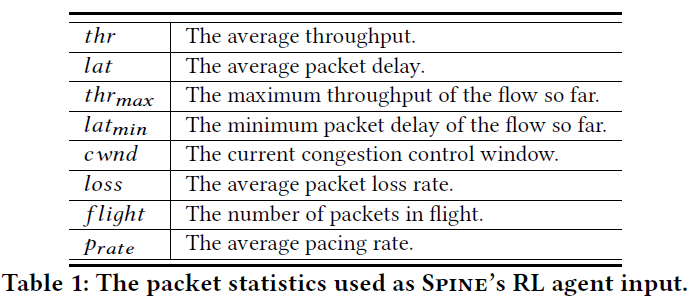
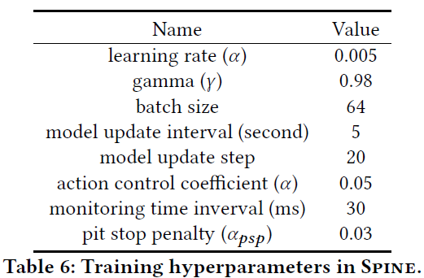

# 1、Spine

        Spine由三个模块组成，策略生成器（policy generator）、观察者（watcher）和一个CC执行器（CC executor）。

        watcher每个MI检测网络状态，判断是否需要更新子策略（利用trigger），如果需要更新则将当前状态输入到policy generator中，计算出子策略中需要使用的四个参数（$\alpha_{lat},\alpha_{thr},\alpha_{tol},\alpha_{loss}$，分别代表cwnd增加大小，cwnd减小大小，对排队延迟的容忍程度以及发生丢包后降速时的因子），并将其传输到内核中的CC executor，根据这四个参数控制。

        policy generator和watcher中的神经网络使用是RNN。

        考虑的网络状态包括的信息如下表：

        训练中遇到的hyperparameters

# 2、ABC: A Simple Explicit Congestion Controller forWireless Networks

        在ABC（§3）中，无线路由器根据当前链路速率的测量估计值，用一位对应于加速或制动的反馈标记每个数据包。当通过来自接收器的ACK接收到该反馈时，发送器在加速时将其窗口增加一个（响应于ACK发送两个分组），在通过来自接收器的ACK接收到该反馈后，发送器在加速时将其窗口增加一个（响应于ACK发送两个分组），并在制动时将其减少一个（不发送任何分组）。这种简单的机制允许路由器在一个RTT内发出窗口大小变化的大动态范围的信号：从将窗口限制为0到将窗口加倍。

        这是个显式的拥塞控制，看起来跟想要的不太符合。

# 3、LiteFlow: Towards High-performance Adaptive Neural Networks for Kernel Datapath

        

        从下图中，我们可以观察到Aurora需要约800次迭代（接收约800个数据包）来执行彻底的探索。只有当在线自适应完成探索时，数据路径中的神经网络才能实现理想的性能。

