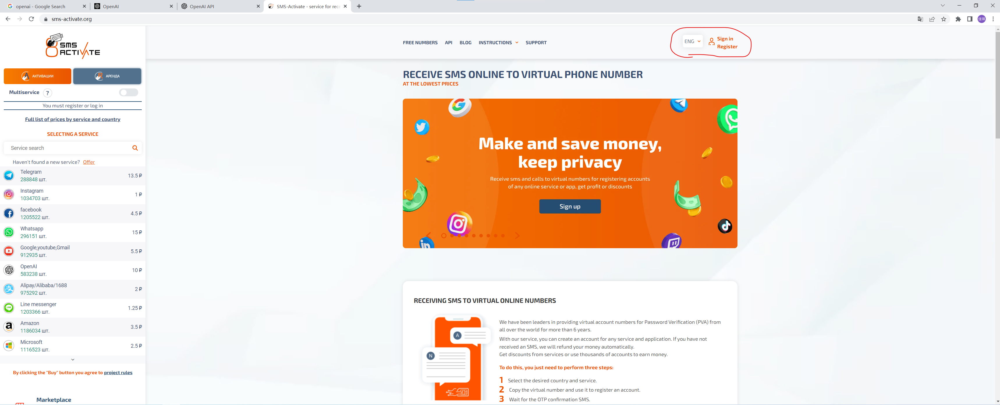

# 注册ChatGPT教程

# 1、打开clash，选择节点

**注意，注册ChatGPT的时候要选择<mark>新加坡或者美国</mark>的节点。**

注册之后使用的时候选一个延迟最低的节点即可，一般是香港的。

# 2、进入ChatGPT

        进入[OpenAI](https://openai.com/)官网

# 3、进入注册

## 3.1 点击Sign up，进入注册。

## 3.2 创建账户

        输入邮箱然后点击Continue。也可以使用Google账户或者Microsoft账户登陆，如果你有Microsoft账户的话，建议直接用微软账户，注册的过程会简单一些。（但是我的微软账户已经注册过了，没法给你演示，所以下面的截图以邮箱注册为例。）

## 3.3 输入密码，然后点击Continue

        如果出现下面的情况，更换一个节点即可。

## 3.4 随后OpenAI会给你注册的邮箱发一封确认邮件

        点击确认即可。（注意，这个邮件有可能在垃圾邮件里，所以收件箱里没看到的话可以去垃圾邮件里找找。）

        弹出下面页面即为验证成功。

## 3.5 登陆

        回到3.1的页面，点击Log in。

        输入刚注册时填写的邮箱及密码（如果选择的是Microsoft或Google登陆直接点下面的Continue with Google或者是Continue with Microsoft Account）。

        输入姓名和年龄。（年龄这个只要选的大于等于18应该就可以，我选的是1999.1.1）

## 3.6 验证手机号

### 3.6.1 跳转到下面页面

        这个页面不要关，打开下面的网址，买一个临时的国外手机号。

### 3.6.2 进入[sms](https://sms-activate.org/)网站

        （sms是一个使用国外手机号收短信的平台）

        点右上角的注册

        填写邮箱和密码后，你的邮箱会收到一个邮件，打开邮件，点击confirm。

        然后会自动跳转到sms的网站上。

### 3.6.3 充值

        点击右上角的Balance下面的小箭头，然后点Top up balance

        然后页面划到最下面，找到Alipay，这个是支付宝。

        输入充值金额（最少2美元），然后点下面的To pay。

        然后手机支付宝扫一扫付钱就行了。

### 3.6.4 选择手机号

        在网站主页的最左侧，有一些选项，找到OpenAI。

        然后选择国家，建议选择巴西的手机号，然后点击右边的购物车图标。

        下面的+552开头的就是买的手机号，有20min的使用权限，把这个手机号复制出来，注意只需要复制括号后面的，比如我给你截图的只需要复制9323217就行。

### 3.6.5 输入刚复制的手机号

        将刚复制的手机号粘贴到3.6.1中的那个页面中，注意将国家选成巴西。

        然后点Send code，回到3.6.4最后那个页面，等待收到一个验证码，然后将验证码复制到chatGPT注册的页面上。然后就注册完成了。

# 4、使用

        进入[chatGPT](https://chat.openai.com/chat)的网站。
